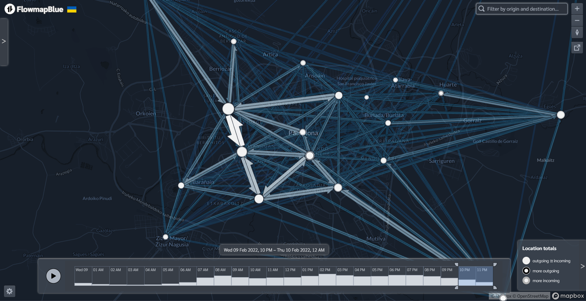

## Introduction

- Context: new digital tools for transport planning
- **Reproducible data science** -> impact
- **Reproducible data science** -> effectively integrate **AI** into your work
- Excel-based analysis -> dynamic, reproducible, scalable workflows
- **AI has potential to reshape every sector and organisation** 
  - Potential only realised by people using reproducible workflows
- Goal: explain what this means and how to get started in this space

## What are Data Science and AI?

> Data science: turns raw data into understanding and insight

> AI: generative language models to generate code and other outputs for decision-making.

- **Machine Learning**: pattern recognition, prediction, and optimisation: from traffic forecasting to demand modelling.
- In transport, this means handling a wide range of data sources including datasets on transport infrastructure, behaviour and more
  - There's more data than ever before
  - Example: OpenStreetMap data which is available worldwide [@boeing_osmnx_2017].

## AI for Transport Planning

- AI is transforming transport (e.g., traffic prediction, safety analysis), but its value is unlocked only when integrated into reproducible workflows.
- **Why reproducible environments are the best way to leverage AI**:

| Key Advantage | How Reproducibility Enables This | Impact on AI & Planning |
|---|---|---|
| **Auditability & Trust** | Version control (Git) logs every step, dataset, and random seed. | Prevents black-box results; ensures public policy decisions are auditable. |
| **AI-Assisted Coding** | Workflows are text-based scripts (Python/R) rather than hidden GUI menus. | AI assistants can directly write, debug, and explain code in your editor. |
| **Agentic Loops** | Execution pipelines are programmatic, automated, and self-contained. | AI agents can run automated loops to optimize parameters and test models. |
| **Robust Stability** | Package managers (Conda/Pip) pin dependencies and library versions. | Combats the non-deterministic nature of AI to ensure consistent results. |

- The key insight: AI works best when the environment is **defined in code**, so every iteration is captured, auditable, and repeatable.

## Why Reproducibility Matters

- **Reproducibility:** Others (or future you) can run your code and get the exact same results.
- **Excel vs. Code:**
  - *Excel:* Steps are hidden behind point-and-click menus; difficult to audit, version, or scale.
  - *Code:* Every transformation is explicitly documented, version-controlled, and repeatable.
- **AI + Reproducibility:** AI assistants help write reproducible pipelines faster, but the pipeline must remain **transparent and scripted** to be verified.
- **Transparency:** Crucial for public policy and planning — AI-driven decisions in transport affect people's lives.

## The Power of (AI-Powered) Programming

- **Flexibility:** You are not limited by what a GUI dropdown menu allows.
- **Scalability:** The same script can process 10 rows or 10 million rows.
- **Sharing & Collaboration:** Open-source packages mean you stand on the shoulders of giants.
- **Automation:** Spend more time thinking and designing solutions, less time copy-pasting.
- **AI as an Accelerator:** Assistants generate boilerplate and explain errors, but understanding the code you run is still essential.
- **The Learning Curve:** Programming has a steeper start than point-and-click tools. The Python tutorials in this module are designed to guide you step-by-step.

## Tools of the Trade

::::: columns
::: {.column width="50%"}

- **Python:** A first-class citizen in data science and AI. Versatile and powerful.
- **R:** Excellent for statistics and spatial analysis [@arribas-bel_course_2019].
- **Quarto:** The multi-language publishing tool — mixes code, text, and output; renders to slides, PDF, HTML [@allaire_quarto_2024].

:::
::: {.column width="50%"}

- **AI coding assistants:** Tools like GitHub Copilot work directly in your editor, helping you write, understand, and debug code faster.
- **The ecosystem:** These tools combine — Python/R for analysis, Quarto for communication, AI assistants for productivity.

{width="80%" fig-alt="Reproducible data science environment"}

:::
:::::

## Interactive Visualisations

::::: columns
::: {.column width="50%"}

- Made possible with code (e.g., Python's `Streamlit`, `Plotly`, or R's `Shiny`).
- **Impact:** Stakeholders can "play" with the data.
- Examples: 
  - Propensity to Cycle Tool (PCT)
  - Interactive road safety maps.
- *Increases the transparency and reach of research.*

:::
::: {.column width="50%"}

{width="100%" fig-alt="Interactive flow map showing origin-destination data"}

:::
:::::

## Making the Most of Transport Data

- **Diverse Data Sources:** Smart card taps, GPS trajectories, traffic counts, and crowd-sourced feeds.
- **Where the value lies:** Not in raw datasets, but in your processing pipeline:
  - **Clean & Validate:** Handling missing values, sensor failures, and anomalies.
  - **Visualise:** Exposing spatial patterns, bottlenecks, and travel trends.
  - **Model:** Predicting demand and optimizing traffic flow.
- **How AI Enhances This:** Automating anomaly detection, clustering travel patterns, and forecasting future demand.
- **Foundation for the Future:** TDCA builds the core skills for working with transport data. These scale directly into next modules like [Transport Data Science (TDS)](https://itsleeds.github.io/tds/).

## Reproducible Workflow with AI

```{mermaid}
flowchart LR
  subgraph Source["Source"]
    A[Raw transport data<br/>sensors, GPS, smart cards]
    B[Scripts<br/>Python / R / Quarto]
  end
  subgraph AI_Layer["AI Integration"]
    C[AI coding assistant<br/>Copilot / Codex]
    D[Agentic loop<br/>iterate, refine, verify]
  end
  subgraph Output["Reproducible Output"]
    E[Interactive dashboards<br/>Streamlit / Shiny]
    F[Published slides<br/>Quarto revealjs]
    G[Version-controlled<br/>Git / GitHub]
  end
  A --> B
  B <--> C
  C <--> D
  B --> E
  B --> F
  B --> G
```

## References {scrollable="true"}

::: {#refs}
:::
