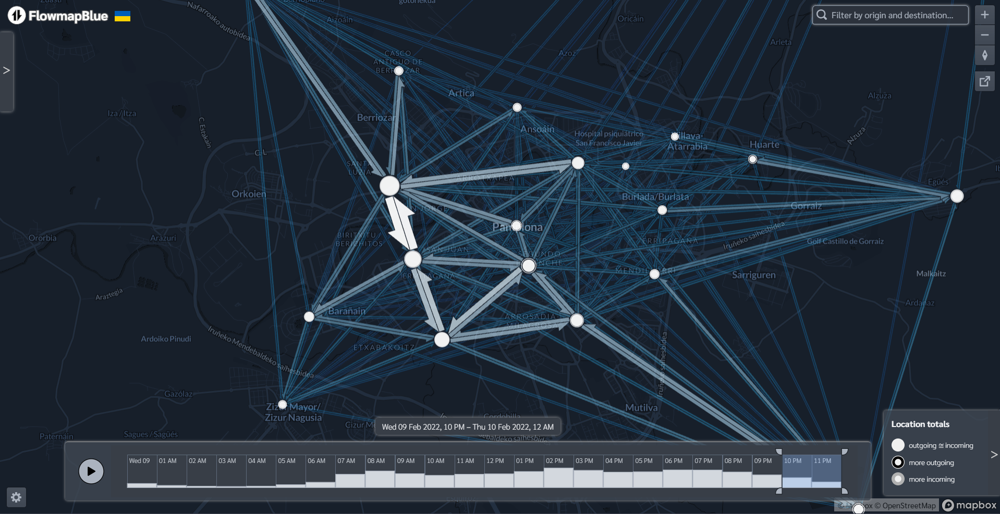
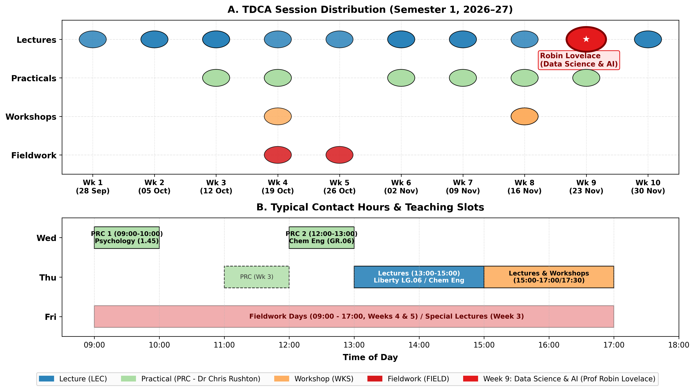

## Introduction

- Context: new digital tools for transport planning
- **Reproducible data science** → impact
- **Reproducible data science** → effectively integrate **AI** into your work
- Excel-based analysis → dynamic, reproducible, scalable workflows
- **AI has potential to reshape every sector and organisation**
  - Potential only realised by people using reproducible workflows
- Goal: explain what this means and how to get started in this space

## What are Data Science and AI?

> **Data science:** turns raw data into understanding and insight.

> **AI:** generative language models to generate code and other outputs for decision-making.

- **Machine Learning:** pattern recognition, prediction, and optimisation — from traffic forecasting to demand modelling.
- In transport, this means handling diverse data sources on transport infrastructure, behaviour, and flows:
  - There is more data than ever before.
  - Example: OpenStreetMap data available worldwide [@boeing_osmnx_2017].

## AI for Transport Planning {.smaller}

- AI is transforming transport (traffic prediction, safety analysis), but value is unlocked only through **reproducible workflows**.

| Key Advantage | How Reproducibility Enables This | Impact on AI & Planning |
|---|---|---|
| **Auditability & Trust** | Version control (Git) logs every step, dataset, and random seed. | Prevents black-box results; ensures public policy decisions are auditable. |
| **AI-Assisted Coding** | Workflows are text-based scripts (Python/R) rather than hidden GUI menus. | AI assistants can directly write, debug, and explain code in your editor. |
| **Agentic Loops** | Execution pipelines are programmatic, automated, and self-contained. | AI agents can run automated loops to optimise parameters and test models. |
| **Robust Stability** | Package managers (Conda/Pip) pin dependencies and library versions. | Combats the non-deterministic nature of AI to ensure consistent results. |

::: {.takeaway-box}
**Key insight:** AI works best when the environment is **defined in code**, so every iteration is captured, auditable, and repeatable.
:::

## AI in Action: JamCam Lab & Computer Vision {.smaller}

::::: columns
::: {.column width="54%"}

- Real-world AI project: [JamCam Lab (`tfl_yolo`)](https://github.com/chris-r-uol/tfl_yolo), developed by Dr Christopher Rushton (ITS Leeds).
- Uses YOLO object detection on ~890 live Transport for London (TfL) roadside camera feeds.
- Automated counting and classification of vehicles, cyclists, and pedestrians.
- Demonstrates why AI outputs must be paired with camera calibration, perspective correction, validation, and domain expertise.

::: {.takeaway-box}
**Core planning insight:** *"Getting counts out of a traffic camera is easy; getting counts you would defend in public is the whole course."*
:::

:::
::: {.column width="46%"}

::: {.card-panel}
[Direct Link to TDCA Practicals]{.card-title}

- Connects computer vision to spatial transport analysis.
- Reproducible pipeline:
  `fetch` → `detect` → `calibrate` → `aggregate` → `validate` → `merge`.
- Accessible via **GitHub Codespaces** with zero local installation.
:::

:::
:::::

## The AI Paradox: Upsides and "AI Surrender" {.smaller}

::::: columns
::: {.column width="50%"}

::: {.card-panel}
[Great Potential Upsides]{.card-title}

- **Rapid Prototyping:** Instant generation of boilerplate code, data wrangling pipelines, and plotting syntax.
- **Error Diagnostics:** Fast explanations for obscure stack traces and package dependency errors.
- **Exploratory Breadth:** Quickly learning new libraries (e.g., GeoPandas, Shapely, PyTorch, Quarto).
:::

:::
::: {.column width="50%"}

::: {.card-panel .card-warn}
[The Risk of "AI Surrender"]{.card-title}

- **Cognitive Surrender:** Documented by the [MIT Committee on AI in Education](https://facultygovernance.mit.edu/) [-@mit_ai_committee_2026].
- **Loss of Productive Struggle:** Outsourcing cognitive effort at the first sign of difficulty.
- **The "Illusion of Learning":** Fast correct answers create a false sense of mastery without mental encoding.
- **Social Erosion:** Marked drops in study group collaboration and office hour attendance.
:::

:::
:::::

## Empirical Evidence: Homework vs. Exams {.compact}

::::: columns
::: {.column width="42%"}

- **The Generative AI Penalty:** Randomised trial by @bastani_generative_2025 in *PNAS*:
  - Practice scores rose **+48%** with standard AI ("GPT Base").
  - On unassisted exams, those same students scored **17% worse** than students who never used AI.
- **International Evidence (26,000+ students):** Unrestricted AI boosts homework (**+18%**) while closed-book exam scores drop (**−20%**).
- **The Remedy:** Guardrails and friction ("GPT Tutor") that prompt thinking rather than copy-paste solutions.

:::
::: {.column width="58%"}

![Impact of generative AI on practice vs. unassisted exam performance and international educational indicators [@bastani_generative_2025; @mit_ai_committee_2026].](images/ai-homework-vs-exams.png){width="100%" fig-alt="Chart comparing AI impact on homework versus unassisted exams"}

:::
:::::

## Why Reproducibility Matters

- **Reproducibility:** Others (or future you) can run your code and get the exact same results.
- **Excel vs. Code:**
  - *Excel:* Steps are hidden behind point-and-click menus; difficult to audit, version, or scale.
  - *Code:* Every transformation is explicitly documented, version-controlled, and repeatable.
- **AI + Reproducibility:** AI assistants help write reproducible pipelines faster, but the pipeline must remain **transparent and scripted** to be verified.
- **Transparency:** Crucial for public policy and planning — AI-driven decisions in transport affect people's lives.

## The Power of (AI-Powered) Programming

- **Flexibility:** You are not limited by what a GUI dropdown menu allows.
- **Scalability:** The same script can process 10 rows or 10 million rows.
- **Sharing & Collaboration:** Open-source packages mean you stand on the shoulders of giants.
- **Automation:** Spend more time thinking and designing solutions, less time copy-pasting.
- **AI as an Accelerator:** Assistants generate boilerplate and explain errors, but understanding the code you run is still essential.
- **The Learning Curve:** Programming has a steeper start than point-and-click tools. The Python tutorials in this module guide you step-by-step.

## Tools of the Trade

::::: columns
::: {.column width="48%"}

- **Python:** A first-class citizen in data science and AI. Versatile and powerful.
- **R:** Excellent for statistics and spatial analysis [@arribas-bel_course_2019].
- **Quarto:** The multi-language publishing tool — mixes code, text, and output; renders to slides, PDF, HTML [@allaire_quarto_2024].

:::
::: {.column width="52%"}

- **AI coding assistants:** Tools like GitHub Copilot work directly in your editor, helping you write, understand, and debug code faster.
- **The ecosystem:** Python/R for analysis, Quarto for communication, AI assistants for productivity.

{width="82%" fig-alt="Reproducible data science environment"}

:::
:::::

## Interactive Visualisations

::::: columns
::: {.column width="46%"}

- Made possible with code (e.g., Python's `Streamlit`, `Plotly`, or R's `Shiny`).
- **Impact:** Stakeholders can "play" with the data.
- Examples:
  - Propensity to Cycle Tool (PCT)
  - Interactive road safety maps.
- *Increases the transparency and reach of research.*

:::
::: {.column width="54%"}

{width="100%" fig-alt="Interactive flow map showing origin-destination data"}

:::
:::::

## Making the Most of Transport Data

- **Diverse Data Sources:** Smart card taps, GPS trajectories, traffic counts, and crowd-sourced feeds.
- **Where the value lies:** Not in raw datasets, but in your processing pipeline:
  - **Clean & Validate:** Handling missing values, sensor failures, and anomalies.
  - **Visualise:** Exposing spatial patterns, bottlenecks, and travel trends.
  - **Model:** Predicting demand and optimising traffic flow.
- **How AI Enhances This:** Automating anomaly detection, clustering travel patterns, and forecasting future demand.
- **Foundation for the Future:** TDCA builds the core skills for working with transport data — scaling directly into [Transport Data Science (TDS)](https://itsleeds.github.io/tds/).

## Programmatic Data Import {.smaller}

::::: columns
::: {.column width="48%"}

- **Skip manual downloads:** Import datasets directly in code via URLs, APIs, GitHub releases, or data packages rather than point-and-click portals.
- **Reproducible & auditable:** Every analysis starts from a scripted, versioned data source that anyone can re-run.
- **Scale effortlessly:** Handle national-scale datasets (e.g., UK 2021 Census OD flows, OpenStreetMap, DfT counts) with the same code.
- **Example:** England & Wales 2021 Census origin–destination desire lines coloured by `% Car` mode share.
- **Source:** [github.com/itsleeds/2021-census-od-data](https://github.com/itsleeds/2021-census-od-data)

:::
::: {.column width="52%"}

.](images/2021-census-od-car-share.jpg){width="100%" fig-alt="Map of England and Wales 2021 Census origin-destination desire lines coloured by percentage car mode share"}

:::
:::::

## TDCA Timetable (2026–27) {.compact}

::::: columns
::: {.column width="42%"}

- **Structured Learning:** Balanced progression across Semester 1 (Weeks 1–10, Oct–Dec 2026).
- **Practicals:** Dr Christopher Rushton (Wednesdays & Thursdays) in computer clusters.
- **Lectures & Workshops:** Thursdays (Liberty Building & Chem Eng) covering survey design, sensor data, and modelling.
- **Fieldwork:** Full-day data collection sessions (Fridays, Weeks 4 & 5).
- **Week 9 Highlight:** *Data Science and AI for Transport Planning* — Prof Robin Lovelace (Thu 26 Nov 2026, 13:00–14:00).
- **Datasets:** [CSV](timetable.csv) | [Leeds Timetable Portal](https://timetable.leeds.ac.uk/teaching/202627/reporting/Individual?objectclass=module&idtype=name&identifier=TRAN5032M01&template=SWSCUST+module+Individual&days=1-7&weeks=1-52&periods=1-21)

:::
::: {.column width="58%"}

{width="100%" fig-alt="TDCA module timetable schedule visualization"}

:::
:::::

## Reproducible Workflow with AI

```{mermaid}
flowchart LR
  subgraph Source["Source & Code"]
    A["Raw transport data<br/>sensors, GPS, smart cards"]
    B["Scripts & Notebooks<br/>Python / R / Quarto"]
  end
  subgraph AI_Layer["AI Integration"]
    C["AI coding assistant<br/>Copilot / Codex"]
    D["Agentic loop<br/>iterate, refine, verify"]
  end
  subgraph Output["Reproducible Outputs"]
    E["Interactive dashboards<br/>Streamlit / Shiny"]
    F["Published slides & docs<br/>Quarto HTML / PDF"]
    G["Version-controlled repo<br/>Git / GitHub"]
  end
  A --> B
  B <--> C
  C <--> D
  B --> E
  B --> F
  B --> G
```

## References

::: {#refs}
:::

## Feedback & Questions

::: {style="text-align: center; margin-top: 0.4em;"}

{width="360px" fig-alt="QR code linking to https://forms.cloud.microsoft/e/tBUQLHwcbu"}

[forms.cloud.microsoft/e/tBUQLHwcbu](https://forms.cloud.microsoft/e/tBUQLHwcbu){style="font-size: 0.9em;"}

:::
